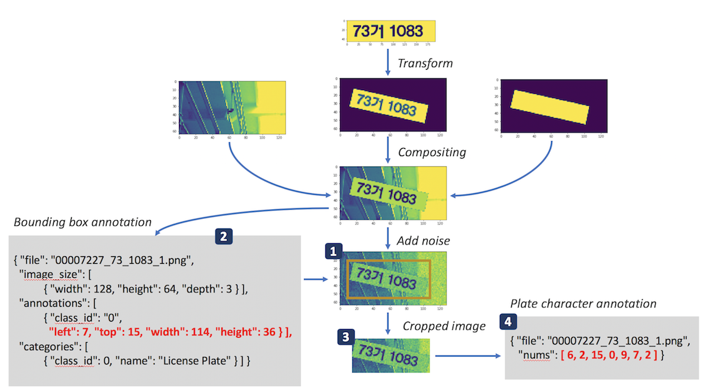
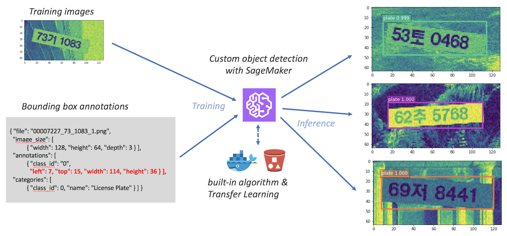
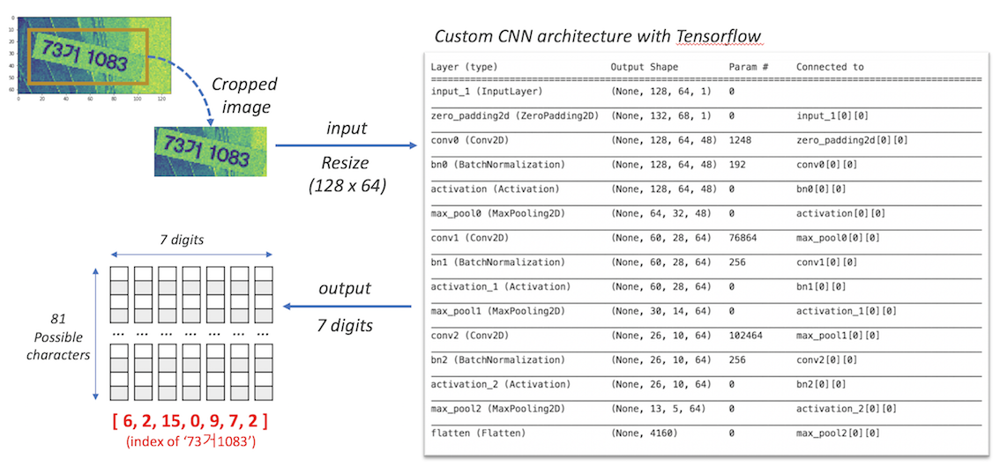
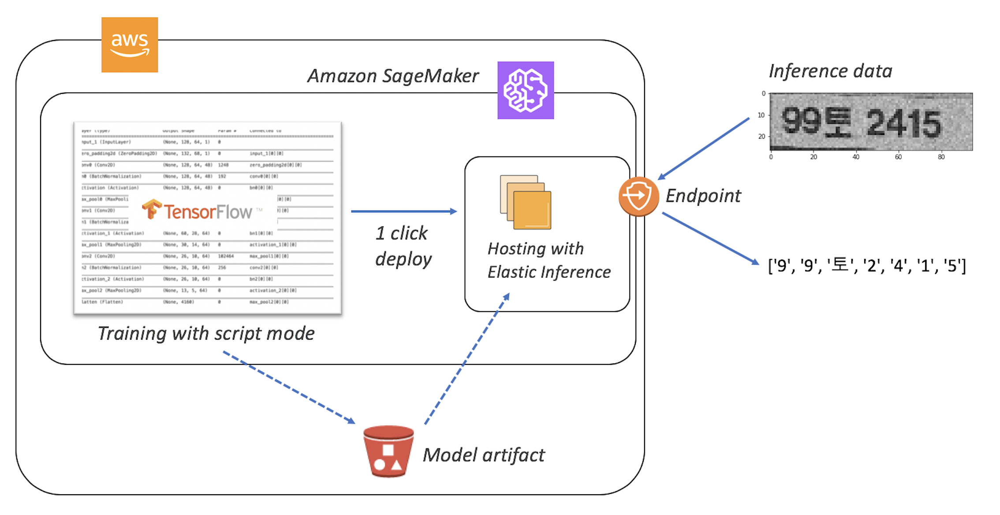
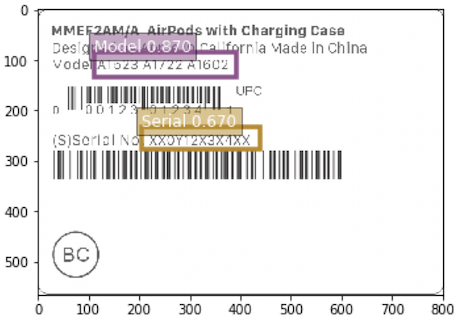

# SageMaker Custom model development Hands-on Lab

The goal of this notebook is to show how to develop custom Machine Learning models on SageMaker for your business usecase. 
You will use the SageMaker built-in object detection algorithm and Tensorflow docker images to detect license plate of a car and recognize the characters of the plate using CNN and computer vision technology. 

This HoL consists of four labs, each with the following details:

  

## [Lab1. Data preparation](Lab1-data-prep.ipynb)
- Generating images and annotation data for ML training 
- Image synthesis  
- Example structure of annotation file  

  
- You will generate:  
 1)license plate images  
 2)license plate position annotations  
 3)cropped plate images  
 4)license plate characters annotations files  
  
  
  
  
  

  

## [Lab2. Custom object detection with SageMaker built-in algorithm](Lab2-custom-object-detection.ipynb)
- Using SageMaker built-in algorithm
- Developing custom Object Detection 
- Leveraging Transfer Learning (Resnet-50)

  
- You will train custom object detection algorithm from license plate images and license plate position annotations.
  
  
  
   

  

## [Lab3. Custom CNN script with Tensorflow and Keras](Lab3-custom-CNN-script-with-TF.ipynb)
- Composing custom CNN(Convolution Neural Net) architecture with Tensorflow and Keras  
- Developing and testing custom Tensorflow script and before running training jobs on SageMaker

  
- You will construct your own CNN architecture and test it.
  
  
  
  

  

## [Lab4. Training, Deploying and hosting custom model on SageMaker](Lab4-train-deploy-host-on-SM.ipynb)
- Developing with Tensorflow script mode of SageMaker
- Leveraging distributed training in the Cloud
- 1 click deployment and endpoint hosting
- Elastic Inference 
- Invoking endpoint with new data

  
- You will finally build your license character detection model and invoke the model with new data
  
  
  

  
You may expand the result of this Lab to other usecases such as serial number detection of your product, etc.
  
 
  
  
  
  

Seongmoon Kang   

mullue@gmail.com  

