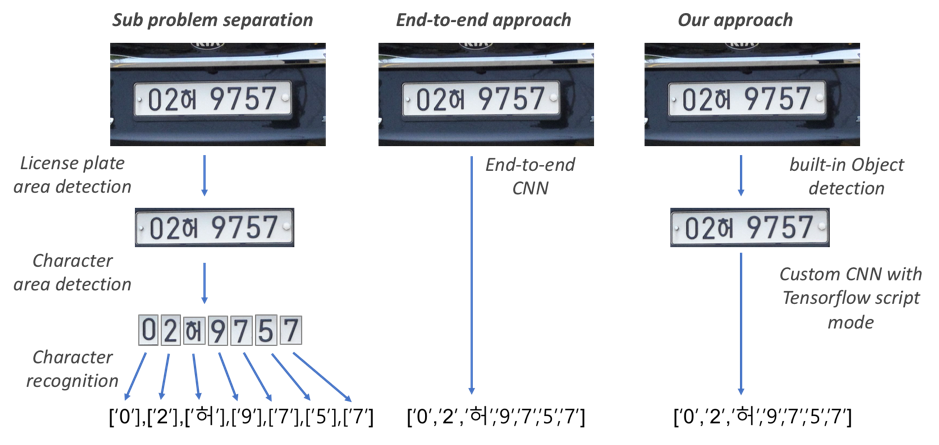
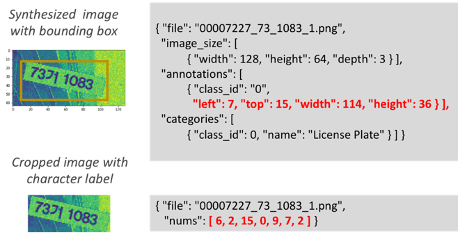
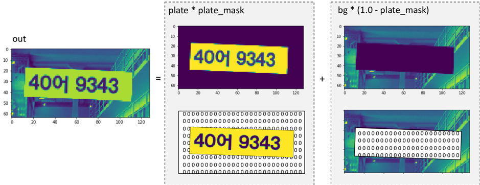
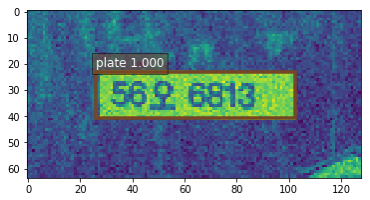
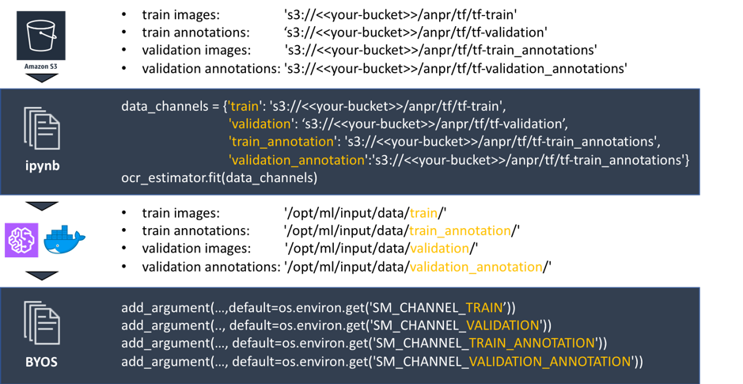
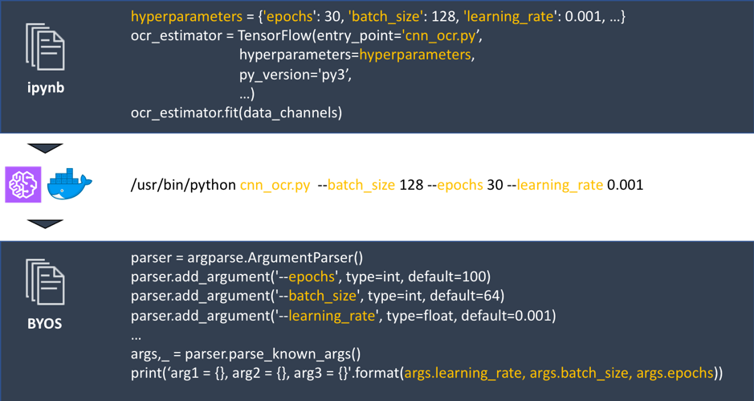
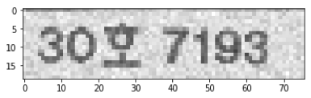
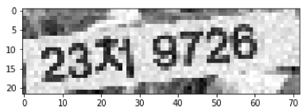
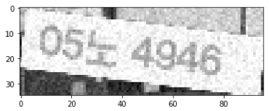
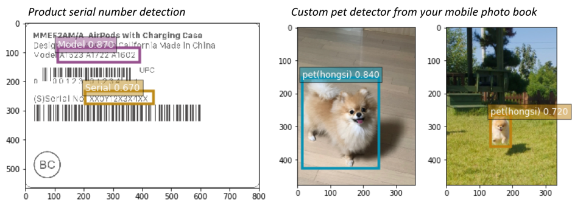

## Building license plate number recognition with SageMaker built-in algorithm and Tensorflow BYOS step-by-step

In this article, you will find how to use SageMaker built-in algorithm and Tensorflow BYOS(Bring Your Own Script) to solve a real problem. Here the problem is to recognize characters of license plates from random images. SageMaker provides algorithms to users in three ways. They are Built-in algorithm, BYOS, and BYOC(Bring Your Own Container) and you will use Built-in algorithm and BYOS very often. The code example consists of 4 Self-study Hands on Labs which you can follow and you can download it from [this link](https://github.com/mullue/lab-custom-model-anpr). The main problem and concept were referenced in [this blog](https://matthewearl.github.io/2016/05/06/cnn-anpr/). 
<br /><br />

### Problem and project definition

We will divide our problem into two parts: the problem of detecting the area of the license plate from images and the problem of recognizing characters from license plate area. This choice can be an example of whether to solve the ML problem with end-to-end approach or sub-problem separation. 
  
The diagram below shows an example of approaches that prepare a machine learning project. Many commercial companies that deal with license plate recognition usually follow the sub-problem separation approach like 1st picture. They detect license plate area first, and detect character’s image areas next, and then finally recognize the characters from the each character's image areas. And, of course, there are many end-to-end approaches being tried. You can refer to Metthew's blog as an example of end-to-end approach like 2nd picture. In our example, we will take a moderate approach like the 3rd picture.

  

We will use the Korean license plate as test data. Each country's license plate has a limited number of characters. In Korea, the following 81 characters are used. You can generate random 7 character sequences (6 numbers and 1 Korean character at 3rd position) as test data by composing these characters. (source: [wikipedia](https://ko.wikipedia.org/wiki/%EB%8C%80%ED%95%9C%EB%AF%BC%EA%B5%AD%EC%9D%98_%EC%B0%A8%EB%9F%89_%EB%B2%88%ED%98%B8%ED%8C%90))
```python
NUMS =['1', '2', '3', '4', '5', '6', '7', '8', '9', '0']
CHARS=['가', '나', '다', '라', '마', '거', '너', '더', '러', '머', '고', '노', '도', '로', '모', '구', '누', '두', '루', '무', '버', '서', '어', '저', '처', '커', '터', '퍼', '보', '소', '오', '조', '초', '코', '토', '포', '부', '수', '우', '주', '추', '쿠', '투', '푸', '후',  '그', '느', '드', '르', '므', '브', '스', '으', '즈', '츠', '크', '트', '프', '흐', '바', '사', '아', '자', '차', '카', '타', '파', '하', '허', '호']
SPACE=[' ']
JOIN =NUMS + CHARS + SPACE
```
As you have noticed, it is just a list of possible characters and we will use the index of this list as our training and inference. This means you can expand our problem to the problem of other country's license plate character detection as well as the problem of reading the product serial numbers or signboards. For example, Japanese license plates can have the following characters with numbers according to Wikipedia. (source: [wikipedia](https://en.wikipedia.org/wiki/Vehicle_registration_plates_of_Japan))
```python
CHARS=['さ', 'す', 'せ', 'そ', 'た', 'ち', 'つ', 'て', 'と', 'な', 'に', 'ぬ', 'ね', 'の', 'は', 'ひ', 'ふ', 'ほ', 'ま', 'み', 'む', 'め', 'も', 'や', 'ゆ', 'よ', 'ら', 'り', 'る', 'ろ', 'れ', 'わ', 'あ', 'い', 'う', 'え', 'か', 'き', 'く', 'け', 'こ', 'を']
```
<br />

### Preparing labeled data

In the Lab 1, you will generate synthesized images with labels for your ML training. Image synthesis is a frequently used technique for data augmentation when you do not have enough data. (Even though they are less effective than actual data.)

To create images in the Lab, simply execute the following code in ipynb.

```python
%run gen-w-bbx.py {num_of_images}
```

You will generate 2 kinds of labeled data pair: raw image with the label of license plate area position and cropped image with the label of character index.
  
  
  
<br /><br />
If you are wondering about the image synthesis, below code is the secret. (It's in the gen-w-bbx.py file.)
```python
out = plate * plate_mask + bg * (1.0 - plate_mask)
```
Here, 'plate' is the random sequence of characters. 'plate_mask' is the position of the license plate, which you will add or subtract from plate and background images. In the next diagram, the first term 'plate * plate_mask' is the element-wise multiplication of the plate number image and plate_mask, and the second term 'bg * (1.0 - plate_mask)' will be the element-wise multiplication of background image and inverted mask. And then, you can get a final image by simply adding these two terms. (Lab uses Grayscale for the purpose of simplification.)

  
  
  
<br /><br />
  
### License plate area detection with SageMaker Object Detection algorithm

In Lab 2, you will develop your custom Object Detection model to detect the area of license plate with SageMaker built-in Object Detection algorithm. (https://docs.aws.amazon.com/sagemaker/latest/dg/object-detection.html) You can just follow the guide of ipynb of Lab to upload files into S3, run your training job, deploy the trained model, and lastly test the inference from your deployed model. 

One important concept you need to remember in this Lab is Transfer Learning. As you use built-in algorithm of SageMaker you can turn Transfer Learning on by setting the ‘use_pretrained_model’ hyperparameter as 1(true), which enables you to leverage pre-trained weight of CNN architecture. This allows you to obtain a high quality model with a relatively small number of images. (Lab uses 10,000 images as default but it also works well with 1,000 images.)
```python
od_model.set_hyperparameters(base_network='resnet-50',
                             use_pretrained_model=1,
                             num_classes=1,
                             mini_batch_size=32,
                             epochs=10,
                             learning_rate=0.001,
                             ...)
```
After the 10~20 minutes training, the training will end and you can see the result like below diagram. From the result list, the first number 0 means a label which means license plate in our example. The second 0.99... is the confidence for the detected object(license plate). The consecutive numbers from the third to the last mean relative x, y coordinates in the image, the width of detected area, and the height of the detected area, respectively.  
  
{'prediction': [[0.0, 0.9999839067459106, 0.1715950071811676, 0.27236270904541016, 0.808781623840332, 0.7239940166473389]]}  
  
{'prediction': [[0.0, 0.9999842643737793, 0.20243453979492188, 0.3618628978729248, 0.8014888763427734, 0.6346850991249084]]}  
  
{'prediction': [[0.0, 0.9999804496765137, 0.14474740624427795, 0.230726957321167, 0.8229358196258545, 0.7649730443954468]]}  
   

<br />

### Preparing Tensorflow script with Keras

In Lab 3, you will write your own custom CNN architecture with Tensorflow and run it quickly to check if the code is grammatically correct. It will have 128 x 64 input layer, 3 Convolutional layers with Max Pooling and Batch Normalization, 1 flatten layer right before the output layer, and finally 7 output layers for each character of license plate number. We will reshape input images to 128 x 64. The last output nodes express the probability of each classification among 81 characters. 

You will see the summary of the architecture easily thanks to Keras as below. 
```python
__________________________________________________________________________________________________
Layer (type)                    Output Shape         Param #     Connected to                     
==================================================================================================
input_1 (InputLayer)            (None, 128, 64, 1)   0                                            
__________________________________________________________________________________________________
zero_padding2d (ZeroPadding2D)  (None, 132, 68, 1)   0           input_1[0][0]                    
__________________________________________________________________________________________________
conv0 (Conv2D)                  (None, 128, 64, 48)  1248        zero_padding2d[0][0]             
__________________________________________________________________________________________________
bn0 (BatchNormalization)        (None, 128, 64, 48)  192         conv0[0][0]                      
__________________________________________________________________________________________________
activation (Activation)         (None, 128, 64, 48)  0           bn0[0][0]                        
__________________________________________________________________________________________________
max_pool0 (MaxPooling2D)        (None, 64, 32, 48)   0           activation[0][0]                 
__________________________________________________________________________________________________
conv1 (Conv2D)                  (None, 60, 28, 64)   76864       max_pool0[0][0]                  
__________________________________________________________________________________________________
bn1 (BatchNormalization)        (None, 60, 28, 64)   256         conv1[0][0]                      
__________________________________________________________________________________________________
activation_1 (Activation)       (None, 60, 28, 64)   0           bn1[0][0]                        
__________________________________________________________________________________________________
max_pool1 (MaxPooling2D)        (None, 30, 14, 64)   0           activation_1[0][0]               
__________________________________________________________________________________________________
conv2 (Conv2D)                  (None, 26, 10, 64)   102464      max_pool1[0][0]                  
__________________________________________________________________________________________________
bn2 (BatchNormalization)        (None, 26, 10, 64)   256         conv2[0][0]                      
__________________________________________________________________________________________________
activation_2 (Activation)       (None, 26, 10, 64)   0           bn2[0][0]                        
__________________________________________________________________________________________________
max_pool2 (MaxPooling2D)        (None, 13, 5, 64)    0           activation_2[0][0]               
__________________________________________________________________________________________________
flatten (Flatten)               (None, 4160)         0           max_pool2[0][0]                  
__________________________________________________________________________________________________
d1 (Dense)                      (None, 81)           337041      flatten[0][0]                    
__________________________________________________________________________________________________
d2 (Dense)                      (None, 81)           337041      flatten[0][0]                    
__________________________________________________________________________________________________
d3 (Dense)                      (None, 81)           337041      flatten[0][0]                    
__________________________________________________________________________________________________
d4 (Dense)                      (None, 81)           337041      flatten[0][0]                    
__________________________________________________________________________________________________
d5 (Dense)                      (None, 81)           337041      flatten[0][0]                    
__________________________________________________________________________________________________
d6 (Dense)                      (None, 81)           337041      flatten[0][0]                    
__________________________________________________________________________________________________
d7 (Dense)                      (None, 81)           337041      flatten[0][0]                    
==================================================================================================
Total params: 2,540,567
Trainable params: 2,540,215
Non-trainable params: 352
__________________________________________________________________________________________________
```
<br />

### Bring your own script to SageMaker Tensorflow Estimator

In Lab 4, you will see how to modify the code of Lab 3 to run on Amazon SageMaker. For TensorFlow versions 1.11 and later, the SageMaker Python SDK supports script mode training scripts. With this mode, you can write BYOS in much the same way as you would in an existing environment. 

The most important modification to run the code on SageMaker is to match the input/output channels of the data. In terms of the input channel, SageMaker training job runs based on Docker Container and it assumes that the training data is on the S3. In this case, how does the training job that runs on Docker Container access the data in S3? 

The following picture illustrates the process of the data mapping that occurs at this case. At first, you upload your data into S3. Next, in your python notebook, you will pass those S3 path into your training job as a parameter. And then SageMaker will copy the S3 data into the '/opt/ml/input/data/{channel}/' folder in your Docker Container. Therefore, in your BYOS(entry point script), you should refer those folders of '/opt/ml/input/data/{channel}/' path.  

  
<br />
    
Notice the orange channel names in the picture above. If you pass data interface channels as a JSON key, value format, SageMaker will create each folders in your Docker Container '/opt/ml/input/data/' folder such as '/opt/ml/input/data/train/', '/opt/ml/input/data/validation/', etc.

After the training job is finishes, the result should be sent back to S3. SageMaker will copy the trainned model from the folder '/opt/ml/model' to S3 at the end of training. Therefore, you can just put your trained model to this folder like below example.

```python
# save checkpoint for locally loading in notebook
saver = tfe.Saver(model_k.variables)
saver.save(model_dir + '/weights.ckpt')
        
# create a separate SavedModel for deployment to a SageMaker endpoint with TensorFlow Serving
tf.contrib.saved_model.save_keras_model(model_k, model_dir)
```
          

One more thing to understand is the control of hyperparameters. You may want to control hyperparameters like 'learning rate', 'number of epochs', etc. externally. Refer to the below picture. When you initiate your training job in your Jupyter notebook, hyperparameters will be passed as arguments of the python run command line script like the code in the middle of the picture. (You can find this command from the log of your trining job in Lab4.) And you can use them in your script to tune your job. 

  
<br />

Now you can run your code on SageMaker. In fact, you may start your first script with hard-coded hyperparameters inside the BYOS. The most important part will be the match of in/out channels. You may refer to below resources for more information regarding Tensorflow script mode.

* https://aws.amazon.com/blogs/machine-learning/using-tensorflow-eager-execution-with-amazon-sagemaker-script-mode/
* https://docs.aws.amazon.com/sagemaker/latest/dg/tf.html
* https://github.com/aws-samples/amazon-sagemaker-script-mode


When you finish Lab4, you will see the result like below:

  
['3', '0', '호', '7', '3', '9', '3']  
  
['2', '3', '저', '9', '7', '2', '6']  
  
['0', '5', '느', '4', '9', '4', '6']  
<br />
  
You may find some mistakes like  3rd result above. (it recognized Korean character '노' as '느'.) It is a natural at the first stage of the ML project. You may add more synthesis or real data, change the internal architecture of CNN, or break the problem to 3 sub problems (Finding character areas and classifying the character), etc. You will repeat these experiments until you get the desired target quality. 

<br />

### Going further

Now you can create your own custom Object Detection and custom Tensorfllow CNN model with SageMaker if you have labeled data for the object you want to track. For example, you may develop your serial number detector of your product or your custom pet detector from your mobile photo book. (Below are conceptual illustrations.)

  


